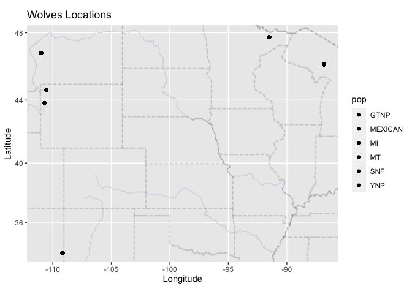

## Instructions
Answer the following questions and complete the exercises in RMarkdown. Please embed all of your code and push your final work to your repository. Your final lab report should be organized, clean, and run free from errors. Remember, you must remove the `#` for the included code chunks to run. Be sure to add your name to the author header above. For any included plots, make sure they are clearly labeled. You are free to use any plot type that you feel best communicates the results of your analysis.  

Make sure to use the formatting conventions of RMarkdown to make your report neat and clean!  

## Load the libraries  

```r
library(tidyverse)
library(janitor)
library(here)
library(ggmap)
```


```r
#devtools::install_gitlab("hrbrmstr/albersusa")

library(albersusa)
```

## Load the Data
We will use two separate data sets for this homework.  

1. The first [data set](https://rcweb.dartmouth.edu/~f002d69/workshops/index_rspatial.html) represent sightings of grizzly bears (Ursos arctos) in Alaska.  

2. The second data set is from Brandell, Ellen E (2021), Serological dataset and R code for: Patterns and processes of pathogen exposure in gray wolves across North America, Dryad, [Dataset](https://doi.org/10.5061/dryad.5hqbzkh51).  

1. Load the `grizzly` data and evaluate its structure.  


```r
grizzly<-read_csv(here("lab13","data","bear-sightings.csv"))
```

```
## Rows: 494 Columns: 3
## ── Column specification ────────────────────────────────────────────────────────
## Delimiter: ","
## dbl (3): bear.id, longitude, latitude
## 
## ℹ Use `spec()` to retrieve the full column specification for this data.
## ℹ Specify the column types or set `show_col_types = FALSE` to quiet this message.
```

2. Use the range of the latitude and longitude to build an appropriate bounding box for your map.  


```r
lat <- c(min(grizzly$latitude), max(grizzly$latitude))
long <- c(min(grizzly$longitude), max(grizzly$longitude))
bbox <- make_bbox(long, lat, f = 0.05)
```

3. Load a map from `stamen` in a terrain style projection and display the map.  

```r
map1 <- get_map(bbox, maptype = "terrain", source = "stamen")
```

```
## ℹ Map tiles by Stamen Design, under CC BY 3.0. Data by OpenStreetMap, under ODbL.
```

```r
ggmap(map1)
```

<!-- -->


4. Build a final map that overlays the recorded observations of grizzly bears in Alaska.  

```r
ggmap(map1) + 
  geom_point(data = grizzly, aes(longitude, latitude)) +
  labs(x= "Longitude", y= "Latitude", title="Grizzly Bear Locations")
```

<!-- -->


Let's switch to the wolves data. Brandell, Ellen E (2021), Serological dataset and R code for: Patterns and processes of pathogen exposure in gray wolves across North America, Dryad, [Dataset](https://doi.org/10.5061/dryad.5hqbzkh51).  

5. Load the data and evaluate its structure.  

```r
wolves<-read_csv("data/wolves_data/wolves_dataset.csv")
```

```
## Rows: 1986 Columns: 23
## ── Column specification ────────────────────────────────────────────────────────
## Delimiter: ","
## chr  (4): pop, age.cat, sex, color
## dbl (19): year, lat, long, habitat, human, pop.density, pack.size, standard....
## 
## ℹ Use `spec()` to retrieve the full column specification for this data.
## ℹ Specify the column types or set `show_col_types = FALSE` to quiet this message.
```


6. How many distinct wolf populations are included in this study? Make a new object that restricts the data to the wolf populations in the lower 48 US states.  


```r
n_distinct(wolves$pop)
```

```
## [1] 17
```

```r
wolves %>% 
  group_by(pop) %>% 
  count(lat) %>% 
  arrange(-lat)
```

```
## # A tibble: 17 × 3
## # Groups:   pop [17]
##    pop       lat     n
##    <chr>   <dbl> <int>
##  1 ELLES    80.5    11
##  2 YUCH     65.1   105
##  3 INT.AK   65.0    35
##  4 N.NWT    63.9    67
##  5 DENALI   63.3   154
##  6 SS.NWT   60.8    34
##  7 BC       57.9   145
##  8 AK.PEN   57.0   100
##  9 SE.AK    55.8    10
## 10 BAN.JAS  52.2    96
## 11 ONT      50.2    60
## 12 SNF      47.7    92
## 13 MT       46.8   351
## 14 MI       46.1   102
## 15 YNP      44.6   383
## 16 GTNP     43.8    60
## 17 MEXICAN  33.9   181
```
Looking at the map, the are 2 states with the largest latitude, North Dakota and Alaska
Thus the wolves in Alaska must be removed any thing above SNF must be removed


```r
wolves<-wolves %>% 
filter(lat<=49)
```


7. Use the range of the latitude and longitude to build an appropriate bounding box for your map.  

```r
lat <- c(min(wolves$lat), max(wolves$lat))
long <- c(min(wolves$long), max(wolves$long))
bbox <- make_bbox(long, lat, f = 0.05)
```


8.  Load a map from `stamen` in a `terrain-lines` projection and display the map.  

```r
map2 <- get_map(bbox, maptype = "terrain-lines", source = "google")
```

```
## ! `maptype = "terrain-lines"` is only available with `source = "stamen"`; resetting source.
```

```
## ℹ Map tiles by Stamen Design, under CC BY 3.0. Data by OpenStreetMap, under ODbL.
```

```r
ggmap(map2)
```

<!-- -->


9. Build a final map that overlays the recorded observations of wolves in the lower 48 states.  

```r
ggmap(map2) + 
  geom_point(data = wolves, aes(long, lat)) +
  labs(x= "Longitude", y= "Latitude", title="Wolves Locations")
```

<!-- -->


10. Use the map from #9 above, but add some aesthetics. Try to `fill` and `color` by population.  

```r
ggmap(map2) + 
  geom_point(data=wolves,aes(long, lat,fill=pop)) +
  labs(x= "Longitude", y= "Latitude", title="Wolves Locations")
```

<!-- -->

```r
ggmap(map2) + 
  geom_point(data=wolves,aes(long, lat,color=pop)) +
  labs(x= "Longitude", y= "Latitude", title="Wolves Locations")
```

<!-- -->


## Push your final code to GitHub!
Please be sure that you check the `keep md` file in the knit preferences. 
